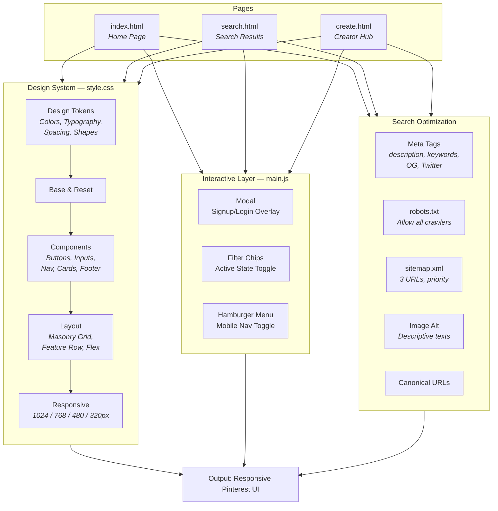

#  Pinterest Design System & Marketing Site

A pixel-perfect, responsive Pinterest marketing website built from the official [DESIGN.md](DESIGN.md) specification. Implements Pinterest's full design system — colors, typography, spacing, shapes, elevation, and components — as a static HTML/CSS/JS frontend.

---

## System Architecture



---

## Dev Stack

| Layer | Technology |
|---|---|
| **Markup** | HTML5 — semantic elements (`<nav>`, `<section>`, `<footer>`) |
| **Styling** | CSS3 — custom properties, flexbox, multi-column masonry, media queries |
| **Interactivity** | Vanilla JavaScript (ES6) — no frameworks or libraries |
| **Typography** | Inter (Google Fonts) — Pin Sans substitute per DESIGN.md spec |
| **Imagery** | picsum.photos — placeholder photography at varied aspect ratios |
| **Iconography** | Inline SVG — Pinterest logo as scalable vector |
| **SEO** | robots.txt, sitemap.xml, Open Graph, Twitter Cards |

**Zero dependencies. Zero build tools. Zero frameworks. Open index.html in any browser.**

---

## Project Stats

| Metric | Value |
|---|---|
| **Pages** | 3 (Home, Search, Creator) |
| **CSS Lines** | 992 |
| **JS Lines** | 65 |
| **Design Tokens** | 27 colors · 10 typography tiers · 7 spacing steps · 5 radius values |
| **Components** | 12 (buttons, inputs, search bar, pin cards, modals, nav, footer, chips, etc.) |
| **Breakpoints** | 5 (1024, 768, 480, 320px + ultrawide) |
| **SEO Meta Tags** | ~15 per page (description, keywords, OG, Twitter, canonical, robots) |
| **Total Size** | ~52 KB (HTML + CSS + JS + XML + txt) |

---

## Design Tokens Implemented

### Colors
```
Primary:      #e60023    Primary Pressed:  #cc001f
Canvas:       #ffffff    Surface Soft:     #fbfbf9
Surface Card: #f6f6f3    Secondary BG:     #e5e5e0
Ink:          #000000    Body:             #33332e
Mute:         #62625b    Ash:              #91918c
Error:        #9e0a0a    Focus Outer:      #435ee5
```

### Typography (Inter — Pin Sans Substitute)
```
display-xl:   70px / 600 / -1.2px    display-lg:    44px / 700 / -0.8px
heading-xl:   28px / 700 / -1.2px    heading-lg:    22px / 600
heading-md:   18px / 600             body-md:       16px / 400
body-sm:      14px / 400             caption-sm:    12px / 400
button-md:    14px / 700
```

### Border Radius
```
rounded-md:   16px    (buttons, pins, cards, inputs)
rounded-lg:   32px    (large cards, modals)
rounded-full: 9999px  (search bar, chips, avatars)
```

---

## Features

### Pages

- **Home Page** (`index.html`) — Hero section with 70px display headline + red CTA, alternating feature cards (left/right layout), category tile grid (4-column), masonry pin grid (4-column), and full footer.

- **Search Results** (`search.html`) — Sticky top nav with active query in search bar, horizontal filter chip strip (All, Beauty makeup, Lipstick, Bold lips, etc.), dense masonry pin grid at 8px gutters.

- **Creator Hub** (`create.html`) — Dark hero CTA strip (`surface-dark` background), creator value propositions in alternating feature cards, and inspiration pin grid.

### Components

- **Primary Nav** — Sticky header with P-logo, nav links, centered pill search bar, right cluster (nav links + Log in + red Sign up CTA).

- **Pin Card** — `border-radius: 16px`, zero internal padding (image is the card), overlay pill anchored at bottom-left corner. All aspect ratios preserved.

- **Feature Card** — 32px padding, 4:5 portrait image + headline + body copy + red CTA, alternating left/right layout.

- **Modal Overlay** — Signup form with scrim (`50% opacity`), `border-radius: 32px`, 16px ambient shadow, 32px internal padding.

- **Button System** — Primary (red), secondary (cream), tertiary (ghost), icon-circular, pill-on-image.

- **Filter Chip** — Pill shape, inverts to black bg on active state.

- **Footer** — 4-column link grid, wordmark, copyright.

### SEO Optimization

- Descriptive `<title>` and `<meta name="description">` per page
- `<meta name="keywords">` with targeted search terms
- Open Graph (`og:title`, `og:description`, `og:image`, `og:url`)
- Twitter Cards (`summary_large_image`)
- Canonical URLs to prevent duplicate content
- `robots.txt` — allows all crawlers on all paths
- `sitemap.xml` — 3 URLs with priority, changefreq, and lastmod
- Keyword-rich `alt` attributes on all images

### Responsive Breakpoints

| Breakpoint | Pin Grid | Nav | Feature Row | Hero Text |
|---|---|---|---|---|
| 1024px | 3 columns | Full | Side-by-side | 70px |
| 768px | 2 columns | Hamburger + icon search | Vertical stack | 44px |
| 480px | 1 column | Hamburger + icon search | Single-column | 36px |
| 320px | 1 column | Hamburger + icon search | Single-column | 32px |

---

## Instructions

### How to Run

This is a static site. No server or build step required.

1. **Clone or download** the repository
2. **Open any HTML file** in a modern browser:
   ```
   index.html    — Home page
   search.html   — Search results
   create.html   — Creator marketing page
   ```
3. **Navigate between pages** using the nav links

### Project Structure

```
Pinterest-design.md/
├── index.html         # Home page — hero, features, categories, pins, footer
├── search.html        # Search results — filter chips + pin grid
├── create.html        # Creator marketing — CTA strip + feature cards
├── style.css          # Full design system: tokens, components, responsive
├── main.js            # Modal, filter chips, hamburger menu
├── DESIGN.md          # Original design specification (source of truth)
├── robots.txt         # Crawler access policy
├── sitemap.xml        # XML sitemap for search engines
└── README.md          # This file
```

### How to Customize

- **Colors** — Edit CSS custom properties in `:root` (`style.css:1-51`)
- **Typography** — Change font in `style.css` and Google Fonts `<link>` in each HTML
- **Images** — Replace picsum.photos URLs with your own image paths
- **Nav links** — Update `<a>` href attributes in each HTML file
- **Footer links** — Edit list items inside `<footer class="site-footer">`

### SEO Maintenance

- Update `sitemap.xml` with actual domain URL and current dates
- Replace `https://picsum.photos/seed/og*` with real Open Graph images
- Set `lastmod` dates in sitemap on content updates

---

## Configuration

### Design System Variables

All configurable design values live as CSS custom properties at the top of `style.css`:

```css
:root {
  --colors-primary: #e60023;
  --spacing-section: 64px;
  --rounded-md: 16px;
  --font-family: 'Inter', ...;
  --shadow-modal: 0 4px 16px rgba(0, 0, 0, 0.15);
  --scrim-opacity: 0.5;
}
```

### Sitemap Configuration (`sitemap.xml`)

```xml
<url>
  <loc>https://www.pinterest.com/</loc>
  <lastmod>2026-05-29</lastmod>
  <changefreq>daily</changefreq>
  <priority>1.0</priority>
</url>
```

### Robots Configuration (`robots.txt`)

```
User-agent: *
Allow: /
Sitemap: https://www.pinterest.com/sitemap.xml
```

---

## Compliance with DESIGN.md

✅ Pinterest Red (`#e60023`) reserved for CTAs, active tabs, wordmark only  
✅ 16px radius on all interactive elements; 32px on modals; pill on chips  
✅ Pin cards have zero internal padding — image IS the card  
✅ `-1.2px` letter-spacing on display-xl and heading-xl  
✅ No drop shadows on cards (only modal shadow)  
✅ Single red CTA per fold  
✅ Masonry grid preserves natural aspect ratios  
✅ Responsive breakpoints at all spec'd widths  
✅ Inter font as Pin Sans substitute with correct weights  

---

## Known Gaps

- Hover states not implemented (per system policy)
- Mobile app screens not included (web-only chrome)
- Authenticated/logged-in chrome not captured
- Form validation states not styled

---

<sub>Built from [DESIGN.md](DESIGN.md) &mdash; May 2026</sub>
