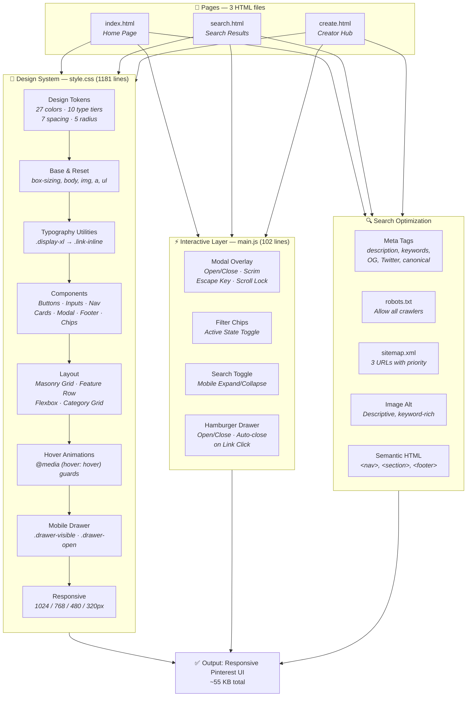

#  Pinterest Design System & Marketing Site

> **A pixel-perfect, responsive Pinterest marketing website** built from the official [`DESIGN.md`](DESIGN.md) specification.  
> Implements Pinterest's full design system — **27 colors, 10 typography tiers, 7 spacing steps, 5 radius values, 15+ components** — as a static HTML/CSS/JS frontend.

---

## ✨ Highlights

- 🎯 **Zero dependencies.** Zero build tools. Zero frameworks. Open any `.html` file in a browser.
- 🎨 **Full tokenized design system** — every color, space, radius, and type size is a CSS custom property.
- 📱 **5 responsive breakpoints** — ultrawide → desktop → tablet → mobile → narrow mobile.
- 🧱 **CSS column-count masonry** — preserves natural aspect ratios of every pin image.
- 🔴 **Single-accent CTA system** — Pinterest Red (`#e60023`) is the only saturated color in chrome.
- 🖼️ **Pin cards have zero internal padding** — the photograph IS the card.
- 🌀 **Hover animations** — tasteful lift effects on pins, cards, and buttons (touch-safe via `@media (hover)`).
- 🧩 **Modal overlay** — signup form with 50% scrim, Escape key dismiss, body scroll lock.
- 🔍 **Mobile search toggle** — magnifier icon expands to full-width search bar on tap.
- 🍔 **Mobile drawer** — hamburger opens a full-width nav drawer with links + actions.
- 📈 **SEO optimized** — OG tags, Twitter Cards, canonical URLs, sitemap.xml, keyword-rich alt texts.

---

## 📐 System Architecture



---

## 🛠️ Dev Stack

| Layer | Technology | Details |
|---|---|---|
| **Markup** | **HTML5** | Semantic elements (`<nav>`, `<section>`, `<footer>`, `<main>`) |
| **Styling** | **CSS3** | Custom properties (61 tokens), flexbox, CSS multi-column masonry, media queries |
| **Interactivity** | **Vanilla JavaScript (ES6)** | No frameworks, no libraries, no build tools |
| **Typography** | **Inter (Google Fonts)** | Pin Sans substitute per DESIGN.md spec — weights 400/500/600/700 |
| **Imagery** | **picsum.photos** | Placeholder photography at varied aspect ratios (1:1, 3:4, 2:3, 4:5) |
| **Iconography** | **Inline SVG + Unicode** | Pinterest P-logo as scalable vector; magnifier, hamburger, close as text/emoji |
| **SEO** | **robots.txt + sitemap.xml + Meta Tags** | Open Graph, Twitter Cards, canonical URLs per page |

### ✅ Zero Dependency Guarantee

```
No package.json · No node_modules · No webpack · No vite · No React · No build step
```

---

## 📊 Project Stats

| Metric | Value |
|---|---|
| **Pages** | 3 (Home, Search Results, Creator Hub) |
| **CSS Lines** | **1181** (61 design tokens + 15+ components + responsive) |
| **JS Lines** | **102** (4 feature modules: modal, chips, search toggle, drawer) |
| **HTML Lines** | 237 (index) + 140 (search) + 205 (create) = **582 total** |
| **Design Tokens** | **27** colors · **10** typography tiers · **7** spacing steps · **5** radius values |
| **Components** | **15+** (primary/secondary/tertiary/icon/pill buttons, inputs, search bar, pin cards, pin-card-large, category tiles, feature cards, modal, nav, footer, filter chips, inline links, drawer) |
| **Hover Animations** | **14** components with `@media (hover: hover)` guarded hover states |
| **Breakpoints** | **5** (ultrawide 1920+ · 1024 · 768 · 480 · 320px) |
| **SEO Meta Tags** | ~**15** per page (description, keywords, OG, Twitter, canonical, robots, theme-color) |
| **Image Alt Texts** | **~40** total across 3 pages (descriptive, keyword-rich, unique) |
| **Total Size** | ~**55 KB** (HTML + CSS + JS + XML + txt) |

---

## 🎨 Design Tokens

### Colors

```
🔴 Primary:         #e60023    🔴 Primary Pressed:  #cc001f
⬜ Canvas:          #ffffff    🟡 Surface Soft:     #fbfbf9
🟡 Surface Card:    #f6f6f3    🟡 Secondary BG:     #e5e5e0
⬛ Ink:             #000000    🔘 Body:             #33332e
🔘 Mute:            #62625b    🔘 Ash:              #91918c
🔵 Error:           #9e0a0a    🔵 Focus Outer:      #435ee5
⬜ On Dark:         #ffffff    ⬛ Surface Dark:     #262622
```

### Typography (Inter — Pin Sans Substitute)

| Token | Size | Weight | Letter-Spacing | Use |
|---|---|---|---|---|
| `display-xl` | **70px** | 600 | **-1.2px** | Hero headline |
| `display-lg` | **44px** | 700 | **-0.8px** | Creator hero |
| `heading-xl` | **28px** | 700 | **-1.2px** | Section headings |
| `heading-lg` | **22px** | 600 | 0 | Modal titles |
| `heading-md` | **18px** | 600 | 0 | Card titles |
| `body-md` | **16px** | 400 | 0 | Body copy |
| `body-strong` | **16px** | 600 | 0 | Emphasis, nav links |
| `body-sm` | **14px** | 400 | 0 | Footer, metadata |
| `body-sm-strong` | **14px** | 700 | 0 | Labels, headers |
| `button-md` | **14px** | 700 | 0 | Button labels |

### Border Radius

| Token | Value | Used On |
|---|---|---|
| `rounded-none` | **0px** | Footer, nav, page sections |
| `rounded-sm` | **8px** | Rare — editorial tooltips |
| `rounded-md` | **16px** | ✅ PRIMARY — buttons, inputs, pin cards, feature cards, tiles |
| `rounded-lg` | **32px** | Large pin cards, modals |
| `rounded-full` | **9999px** | Search bar, filter chips, pills, avatars, icon buttons |

### Spacing System

```
xxs(4px) → xs(6px) → sm(8px) → md(12px) → lg(16px) → xl(24px) → xxl(32px) → section(64px)
```

---

## 📄 Pages

### 🏠 Home Page (`index.html`)

```
[Primary Nav] → [Hero 70px Headline] → [Feature Cards ×3] → [Category Tiles ×4] → [Pin Grid ×8] → [Footer]
```

- **Hero:** 70px display-xl headline ("Create the life you love on Pinterest") + red CTA on cream (`#fbfbf9`) background
- **Feature Cards:** 3 alternating left/right cards with 4:5 portrait image, heading-xl, body copy, red CTA
- **Category Tiles:** 4-up grid of 1:1 square thumbnails (Home Decor, Fashion, Food & Drink, Travel)
- **Pin Grid:** CSS column-count masonry — 8 pins at 8px gutters, includes 2 `pin-card-large` (32px radius)
- **Footer:** 4-column link grid + Pinterest wordmark + copyright

### 🔍 Search Results (`search.html`)

```
[Primary Nav (inner-page)] → [Filter Chip Strip ×8] → [Pin Grid ×12]
```

- **Nav:** Compact layout — P-logo only, centered search bar with "bold lip" query, Log in + Sign up
- **Filter Chips:** 8 pill chips with active toggle — "All" (default active), Beauty makeup, Lipstick, etc.
- **Pin Grid:** 12 pins at tight 8px gutters — pure masonry, no feature cards or categories

### 🎬 Creator Hub (`create.html`)

```
[Dark CTA Strip] → [Primary Nav (inner-page)] → [Creator Hero] → [Feature Cards ×3] → [Pin Grid ×6] → [Footer]
```

- **Dark CTA Strip:** `surface-dark` (`#262622`) background with white heading-xl + red CTA
- **Creator Hero:** Centered 44px display-lg headline + body copy + CTA
- **Feature Cards:** 3 alternating cards — Grow your audience, Monetize content, Creator tools
- **Pin Grid:** 6 pins — creator portfolio inspiration, success stories, analytics

---

## 🧩 Components

### 🔘 Button System

| Variant | Class | BG | Text | Hover Effect |
|---|---|---|---|---|
| **Primary** | `.btn-primary` | `#e60023` | White | → `#cc001f` |
| **Secondary** | `.btn-secondary` | `#e5e5e0` | `#000` | → `#c8c8c1` |
| **Tertiary** | `.btn-tertiary` | Transparent | `#000` | → `#f6f6f3` bg |
| **Icon Circular** | `.btn-icon-circular` | `#f6f6f3` | `#000` | scale(1.05) |
| **Pill on Image** | `.btn-pill-on-image` | `#fff` | `#000` | scale(1.04) + shadow |
| **Disabled** | `.btn-disabled` | `#f6f6f3` | `#91918c` | — |

### 🃏 Pin Card System

```
.pin-card (16px radius)
  └── img.pin-image (full-bleed, natural aspect ratio)
  └── span.pin-overlay-pill (optional — bottom-left corner)

.pin-card-large (32px radius) — same structure, larger corners
```

- **Padding:** Zero — the image IS the card
- **Overlay Pill:** White pill "Cherry red" / "Preppy look" / "Earthy space inspo"
- **Hover:** translateY(-4px) lift + subtle shadow (0.2s ease)
- **Masonry:** `break-inside: avoid`, `column-count` grid, 8px gutters

### 📇 Other Components

| Component | Class | Key Props |
|---|---|---|
| **Search Bar** | `.search-bar` | 48px height, pill shape, 480px max-width, magnifier glyph |
| **Filter Chip** | `.filter-chip` | Pill shape, inverts to black bg on `.active` |
| **Text Input** | `.text-input` | 44px height, 16px radius, double-ring focus (2px ink + 4px blue) |
| **Feature Card** | `.feature-card` | 32px padding, 4:5 image + text side-by-side, `.reverse` for alternating |
| **Category Tile** | `.category-tile` | 1:1 image + label in flex column, 4-up grid |
| **Modal Card** | `.modal-overlay` + `.modal-card` | 50% scrim, 32px radius, 16px shadow, 480px wide |
| **Primary Nav** | `.primary-nav` | 64px sticky, P-logo, search bar, nav links, red CTA |
| **Footer** | `.site-footer` | 4-column link grid, hairline top border, wordmark + copyright |
| **Inline Link** | `.link-inline` | `#211922` color, underline appears on hover |

---

## ⚡ JavaScript Interactions

All vanilla ES6 — no dependencies, ~102 lines, 4 features:

### 1. Modal Overlay (`main.js:1-45`)
- **Open:** Click any "Sign up" or "Log in" button
- **Close:** × button, scrim click, Escape key
- **Scroll Lock:** `body.style.overflow = 'hidden'` when open

### 2. Filter Chip Toggle (`main.js:47-55`)
- Click any chip → removes `.active` from all chips → adds `.active` to clicked chip

### 3. Mobile Search Toggle (`main.js:57-72`)
- Hidden on desktop, visible on mobile (≤768px)
- Tap magnifier → expands search bar to full width, focuses input
- Tap again → collapses back to icon-only

### 4. Hamburger Drawer (`main.js:74-102`)
- Hidden on desktop, visible on mobile (≤768px)
- Opens a full-width nav drawer below the header
- Search bar hides while drawer is open
- Any link click closes drawer automatically

---

## 📱 Responsive Breakpoints

| Breakpoint | Width | Pin Grid | Nav | Feature Cards | Hero Text |
|---|---|---|---|---|---|
| **Desktop** | 1025px+ | **4 columns** | Full horizontal | Side-by-side | **70px** |
| **Tablet** | ≤768px | **2 columns** (6px gutter) | Hamburger + icon search | Vertical stack | **44px** |
| **Mobile** | ≤480px | **1 column** | Hamburger + icon search | Single-column | **36px** |
| **Narrow** | ≤320px | **1 column** | Hamburger + icon search | Single-column | **32px** |

### Collapsing Strategy

- **Nav:** Desktop horizontal → tablet hamburger drawer at 768px. Red Sign-up CTA **always visible**.
- **Search:** Desktop centered (480px) → tablet compressed (200px) → mobile icon-only (40px, expands on tap).
- **Pin Grid:** 4-col → 3-col (1024px) → 2-col (768px) → 1-col (480px).
- **Feature Row:** Alternating side-by-side → vertical stack at 768px → single column at 480px.
- **Modal:** Desktop centered 480px card → mobile bottom sheet (32px top radius only).
- **Section Padding:** 64px → 48px (768px) → 32px (480px).
- **Footer:** 4 columns → 2 columns (768px) → 1 column (480px).

---

## 🚀 How to Run

This is a **static site**. No server, build step, or installation required.

```bash
# Clone the repository
git clone https://github.com/girishlade111/Pinterest-design.md.git

# Open any HTML file directly in your browser
cd Pinterest-design.md
start index.html     # Home page
start search.html    # Search results
start create.html    # Creator marketing page
```

**Navigate between pages** using the nav links in the top bar.

---

## 📁 Project Structure

```
Pinterest-design.md/
│
├── 📄 index.html           # Home page — hero, features, categories, pins, footer
├── 📄 search.html          # Search results — filter chips + dense pin grid
├── 📄 create.html          # Creator marketing — dark CTA strip + feature cards
│
├── 🎨 style.css            # Complete design system (1181 lines)
│   ├── :root — 61 design tokens
│   ├── Typography — 10 utility classes
│   ├── Components — 15+ classes (buttons, inputs, cards, nav, modal, footer)
│   ├── Layout — masonry grid, flexbox, feature rows
│   ├── Hover animations — 14 components with @media guards
│   ├── Mobile drawer — .drawer-visible system
│   └── Responsive — 5 breakpoints
│
├── ⚡ main.js              # Interactive layer (102 lines)
│   ├── Modal overlay (open/close/scrim/escape/scroll lock)
│   ├── Filter chip toggle
│   ├── Mobile search toggle (expand/collapse)
│   └── Hamburger drawer (open/close/auto-dismiss)
│
├── 📖 DESIGN.md            # Original Pinterest design specification (source of truth)
├── 📘 README.md            # This file
├── 📘 PROJECT_CONTEXT.md   # AI assistant reference — full project context
│
├── 🤖 robots.txt           # Crawler access policy
└── 🗺️ sitemap.xml           # XML sitemap (3 URLs)
```

---

## ⚙️ Configuration

### Design System Variables

All configurable design values live as CSS custom properties at the top of `style.css:1-62`. Edit any token to see changes propagate across all components.

```css
:root {
  /* Colors */
  --colors-primary: #e60023;           /* Pinterest Red */
  --colors-primary-pressed: #cc001f;   /* Darker red for hover/pressed */
  --colors-canvas: #ffffff;            /* White surfaces */
  --colors-surface-card: #f6f6f3;      /* Warm cream — pin cards, chips */
  --colors-surface-dark: #262622;      /* Near-black — dark CTA strip */

  /* Typography */
  --font-family: 'Inter', -apple-system, system-ui, 'Segoe UI', Roboto,
                 'Helvetica Neue', Arial, sans-serif;

  /* Spacing */
  --spacing-section: 64px;             /* Vertical section rhythm */
  --spacing-sm: 8px;                   /* Pin grid gutters */
  --spacing-xxl: 32px;                 /* Modal & feature card padding */

  /* Border Radius */
  --rounded-md: 16px;                  /* Primary — most components */
  --rounded-lg: 32px;                  /* Large cards, modals */
  --rounded-full: 9999px;              /* Pills, chips, avatars */

  /* Elevation */
  --shadow-modal: 0 4px 16px rgba(0, 0, 0, 0.15);
  --scrim-opacity: 0.5;
}
```

### Sitemap Configuration (`sitemap.xml`)

```xml
<url>
  <loc>https://www.pinterest.com/</loc>
  <lastmod>2026-05-29</lastmod>
  <changefreq>daily</changefreq>
  <priority>1.0</priority>
</url>
<url>
  <loc>https://www.pinterest.com/search/</loc>
  <lastmod>2026-05-29</lastmod>
  <changefreq>daily</changefreq>
  <priority>0.8</priority>
</url>
<url>
  <loc>https://www.pinterest.com/create/</loc>
  <lastmod>2026-05-29</lastmod>
  <changefreq>weekly</changefreq>
  <priority>0.7</priority>
</url>
```

### Robots Configuration (`robots.txt`)

```
User-agent: *
Allow: /
Sitemap: https://www.pinterest.com/sitemap.xml
```

---

## 🎯 How to Customize

| Change | Location | How |
|---|---|---|
| **Colors** | `style.css:1-37` | Edit CSS custom property values |
| **Typography** | `style.css:40` + Google Fonts `<link>` in each HTML | Change font family URL and property |
| **Border Radius** | `style.css:52-57` | Tweak `--rounded-md`, `--rounded-lg`, etc. |
| **Spacing** | `style.css:42-50` | Adjust any `--spacing-*` token |
| **Images** | All 3 HTML files | Replace `picsum.photos` URLs with your own |
| **Nav links** | All 3 HTML files | Update `<a href="...">` attributes |
| **Footer links** | All 3 HTML files | Edit list items inside `<footer class="site-footer">` |
| **Breakpoints** | `style.css:1011-1181` | Edit `@media` query values |
| **Page content** | Each `.html` file | Edit text, buttons, sections |
| **Add a page** | New `.html` + update nav in all pages | Copy template, update meta tags |

---

## ✅ DESIGN.md Compliance

| # | Requirement | Status |
|---|---|---|
| 1 | Pinterest Red (`#e60023`) reserved for CTAs, active tabs, wordmark only | ✅ |
| 2 | 16px radius on all interactive elements; 32px on modals; pill on chips | ✅ |
| 3 | Pin cards have **zero internal padding** — image IS the card | ✅ |
| 4 | `-1.2px` letter-spacing on display-xl and heading-xl | ✅ |
| 5 | **No drop shadows** on cards (only modal shadow) | ✅ |
| 6 | **Single red CTA per fold** (nav + hero + feature card) | ✅ |
| 7 | Masonry grid preserves **natural aspect ratios** | ✅ |
| 8 | Responsive breakpoints at **all spec'd widths** (1024/768/480/320) | ✅ |
| 9 | Inter font as **Pin Sans substitute** with correct weights (400/500/600/700) | ✅ |
| 10 | Warm-cream neutral chrome — colors surface-soft, surface-card, canvas | ✅ |
| 11 | Sticky top nav with **always-red Sign-up CTA** at every breakpoint | ✅ |
| 12 | Hero/CTA chrome → feature cards → content masonry section flow | ✅ |
| 13 | Asymmetric 2-column feature cards — **alternating left/right** | ✅ |
| 14 | Modal with **50% scrim** + **16px ambient shadow** + Escape dismiss | ✅ |
| 15 | Footer: 4-column grid → 2-up (768px) → 1-up (480px) | ✅ |
| 16 | Filter chips: pill shape, **inverted black bg on active** | ✅ |
| 17 | Pin overlay pill — signature "Cherry red" / "Preppy look" tags | ✅ |
| 18 | 8px pin grid gutters — imagery effectively touches across columns | ✅ |
| 19 | Input double-ring focus signal: 2px ink + 4px focus-outer blue | ✅ |
| 20 | Modal mobile: full-width sheet, rounded top-only, bottom-anchored | ✅ |

---

## ⚠️ Known Gaps

| Gap | Details |
|---|---|
| ❌ **Hover states** | DESIGN.md explicitly does NOT document hovers. Animations were added as enhancement. |
| ❌ **Pin detail overlay** | Single-pin detail view (comments, related pins, save board picker) not implemented |
| ❌ **Authenticated chrome** | Logged-in feed, board pages, profile pages not implemented |
| ❌ **Mobile app screens** | Web-only chrome — Pinterest mobile app not replicated |
| ❌ **Form validation** | Success/error inline messages not styled |
| ❌ **Footer accordion** | DESIGN.md specifies tap-to-expand on mobile — not implemented |
| ❌ **Ultrawide (1920px+)** | Pin grid maxes at 4 columns — 5-6 columns not implemented |

---

<sub>Built from [DESIGN.md](DESIGN.md) · May 2026 · [GitHub Repository](https://github.com/girishlade111/Pinterest-design.md)</sub>
